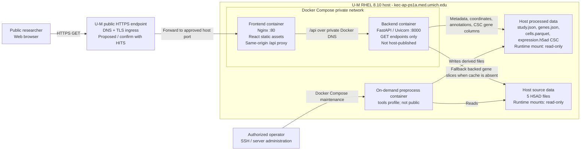

# Single-Cell Study Portal - Architecture and Data Flow

Prepared for U-M public hosting review. Current application host: `kec-ap-ps1a.med.umich.edu` (RHEL 8.10).

## Scope and status

- Solid application components below are implemented in this repository.
- The U-M public DNS, HTTPS, and ingress component is proposed and must be confirmed with the U-M hosting/security team.
- The application is intended for anonymous public, read-only exploration of zebrafish and mouse retinal single-cell data.
- No upload, account, authentication, H5AD download, or write API is exposed.

## Production architecture



## Normal public request flow

```mermaid
sequenceDiagram
    participant B as Researcher browser
    participant E as U-M HTTPS ingress (proposed)
    participant N as Nginx frontend
    participant A as FastAPI backend
    participant P as Processed JSON, Parquet, and CSC cache
    participant H as Read-only H5AD

    B->>E: HTTPS GET /
    E->>N: Forward approved web request
    N-->>B: React, CSS, and JavaScript
    B->>E: GET /api/study, /cells, /genes, /expression, /matrix, or /violin
    E->>N: Same-origin /api request
    N->>A: Proxy over private Docker network
    A->>P: Read cached metadata, coordinates, annotations, gene index, and CSC expression
    opt Expression cache absent
        A->>H: Fall back to a requested gene slice in backed mode
    end
    A-->>B: JSON result through Nginx and ingress
    Note over B: Plotly renders UMAP, dot plot, heat map, or violin plot
    Note over B: Figure export is generated in the browser; source H5AD is not downloadable
```

## Controlled data publication flow

1. An authorized operator transfers an approved H5AD file to protected host storage.
2. The operator runs `docker compose --profile tools run --rm preprocess`.
3. The transient preprocess container reads H5AD files and writes derived `study.json`, `genes.json`, `cells.parquet`, and CSC `expression.h5ad` files.
4. Runtime frontend/backend containers are restarted or redeployed.
5. Runtime containers mount both source and processed datasets read-only.

## Security and operational characteristics

| Area | Current design |
| --- | --- |
| Public surface | One Nginx web port; FastAPI port 8000 is only exposed to the private Docker network. |
| API behavior | GET endpoints only. No file upload, mutation, account, or H5AD download endpoint. |
| Data access | Runtime H5AD and processed-data mounts are read-only and SELinux labeled with `:Z`. |
| Application user | Backend runs as a non-root `app` user. |
| Browser data | Scientific cell identifiers, embeddings, annotations, and expression results are returned as JSON. |
| Figure downloads | Generated client-side from rendered Plotly figures. |
| Health monitoring | Backend `/api/health` health check every 30 seconds through Docker Compose. |
| Source-data assumption | Non-human retinal research data (zebrafish and mouse); no PHI, PII, credentials, or human-subject data expected. Data owner should confirm. |

## Items to confirm with U-M hosting/security

1. Approved public subdomain and DNS ownership.
2. U-M TLS termination / certificate service and whether an institutional reverse proxy or load balancer is required.
3. Approved inbound host port and firewall path from the U-M ingress to the server.
4. Required vulnerability scanning, patching cadence, access-log retention, and monitoring integration.
5. Whether anonymous public access is acceptable for the approved datasets or institutional authentication is required.

